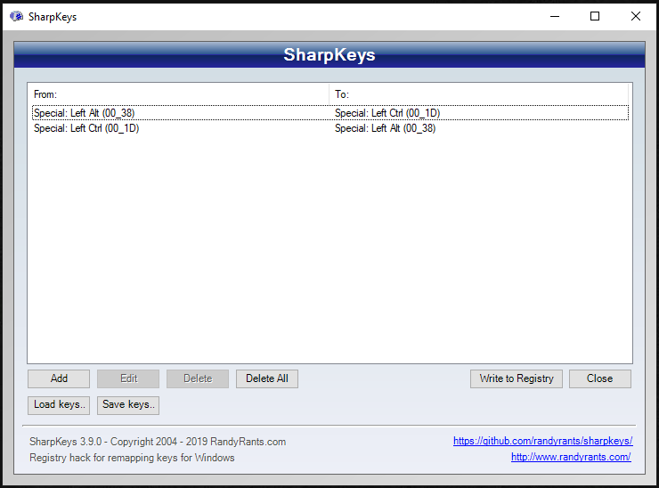
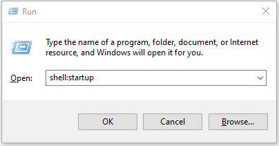
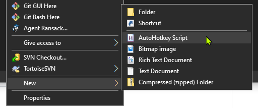
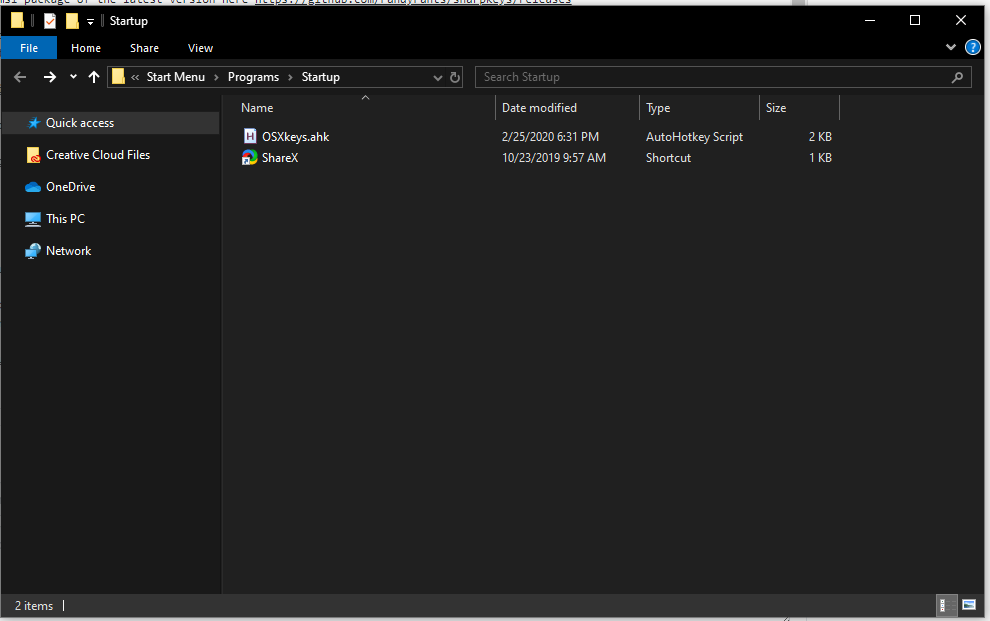
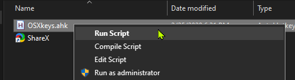
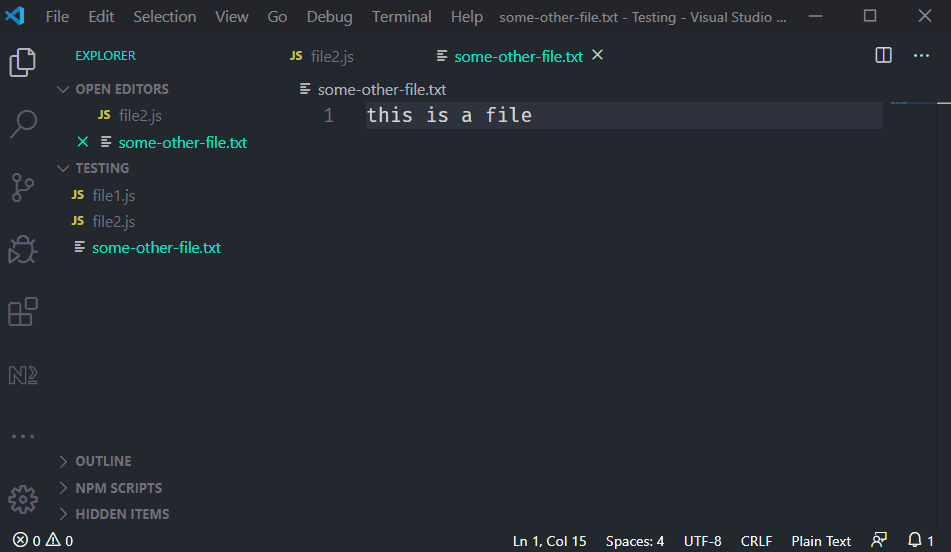

Frequently swapping between OSX and Windows devices can be frustrating due to keyboard shortcut muscle memory. If your goal is to use Mac style shortcuts on a Windows device, this is a hacked together solution for mapping familiar Mac OSX shortcuts to their Windows equivilent counterpart, at least for basic functionality and text editing.

## 1. Install SharpKeys

You can find the msi package of the latest version here https://github.com/randyrants/sharpkeys/releases

SharpKeys is a tool that can be used to remap keys to other keys. This is my configuration, which maps Left Ctrl to Left Alt and vice-versa. After creating these mappings, you will need to sign out and back in for the changes to take place.



## 2. Install AutoHotKey

https://www.autohotkey.com/

AutoHotKey is yet another tool that can be used to remap keys, but is more powerful because it can be used to script entire shortcuts. Could this entire objective have been achieved with just AutoHotKey? Probably so, but the combination of both apps is what I got working first.

## 3. Create an AutoHotKey script to load at startup

Go to Start Menu > Run (or alternatively, Windows Key + R) and run `shell:startup`. This should open a folder in Windows Explorer where our AutoHotKey script will be executed upon startup.



In this folder, create a new .ahk script by `Right clicking > New > AutoHotKey Script`. Alternatively, just creating a file with an `.ahk` file extension will also work. The name of this script doesn't really matter.


You should now have something like this.



## 4. Populate and run the script

This is a script that I found [here](https://medium.com/@chrisdhanaraj/mapping-your-macos-keybinds-to-windows-b6009c50065b) and altered a bit more to enhance the text editing shortcuts.

Alternative, get it [here](./OSXkeys.ahk)

```
#NoEnv  ; Recommended for performance and compatibility with future AutoHotkey releases.
; #Warn  ; Enable warnings to assist with detecting common errors.
SendMode Input  ; Recommended for new scripts due to its superior speed and reliability.
SetWorkingDir %A_ScriptDir%  ; Ensures a consistent starting directory.

; Navigate between apps
LCtrl & Tab:: AltTab
!Tab:: Send ^{Tab}
!+Tab:: Send ^+{Tab}

; Open Windows menu (Spotlight)
^Space:: Send ^{Esc}

; Select previous word
+#Left::
	Send ^+{Left}
Return

; Select next word
+#Right::
	Send ^+{Right}
Return

; Navigate previous word
#Left::
	Send ^{Left}
Return

; Navigate next word
#Right::
	Send ^{Right}
Return

; Navigate to beginning of line
^Left::
    Send {Home}
Return

; Navigate to end of line
^Right::
    Send {End}
Return

; Select to beginning of line
^+Left::
    Send +{Home}
Return

; Select to end of line
^+Right::
    Send +{End}
Return

; Navigate to top of document
^Up::
    Send ^{Home}
Return

; Navigate to end of document
^Down::
    Send ^{End}
Return

; Select to top of document
^+Up::
    Send ^+{Home}
Return

; Select to end of document
^+Down::
    Send ^+{End}
Return

; Close current app
^Q::
	Send !{f4}
Return

; Go to next tab
^#Right::
	Send ^{Tab}
Return

; Go to previous tab
^#Left::
	Send ^+{Tab}
Return
```

## 5. Save and run the script

From the Windows Explorer window where the script resides, right click it and select Run Script.



## 6. Remember to sign out and back in

Because the SharpKeys tool edits the registry and a new session is required.

---

With any luck, you should have an OXS editing experience using familiar shortcuts.


